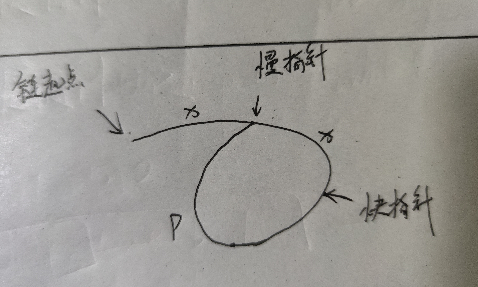
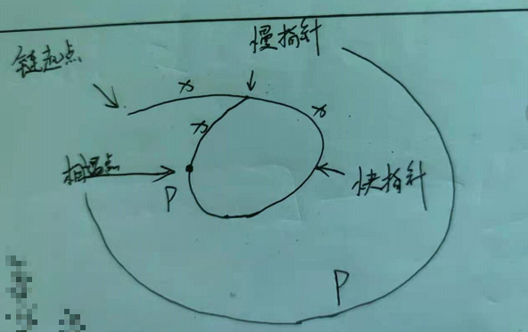

# 链表
<!-- TOC -->

- [链表的基础知识](#%E9%93%BE%E8%A1%A8%E7%9A%84%E5%9F%BA%E7%A1%80%E7%9F%A5%E8%AF%86)
	- [链表的结构](#%E9%93%BE%E8%A1%A8%E7%9A%84%E7%BB%93%E6%9E%84)
	- [访问链表的时间复杂度](#%E8%AE%BF%E9%97%AE%E9%93%BE%E8%A1%A8%E7%9A%84%E6%97%B6%E9%97%B4%E5%A4%8D%E6%9D%82%E5%BA%A6)
	- [几种经典的链表实现方法](#%E5%87%A0%E7%A7%8D%E7%BB%8F%E5%85%B8%E7%9A%84%E9%93%BE%E8%A1%A8%E5%AE%9E%E7%8E%B0%E6%96%B9%E6%B3%95)
- [链表的典型应用场景](#%E9%93%BE%E8%A1%A8%E7%9A%84%E5%85%B8%E5%9E%8B%E5%BA%94%E7%94%A8%E5%9C%BA%E6%99%AF)
- [经典面试题](#%E7%BB%8F%E5%85%B8%E9%9D%A2%E8%AF%95%E9%A2%98)
	- [链表的访问](#%E9%93%BE%E8%A1%A8%E7%9A%84%E8%AE%BF%E9%97%AE)
		- [LeetCode #141 环状链表](#leetcode-141-%E7%8E%AF%E7%8A%B6%E9%93%BE%E8%A1%A8)
		- [LeetCode #142 环状链表II](#leetcode-142-%E7%8E%AF%E7%8A%B6%E9%93%BE%E8%A1%A8ii)
		- [LeetCode #202 快乐数](#leetcode-202-%E5%BF%AB%E4%B9%90%E6%95%B0)
	- [链表的fanzhuang](#%E9%93%BE%E8%A1%A8%E7%9A%84fanzhuang)
		- [LeetCode #206 反转链表](#leetcode-206-%E5%8F%8D%E8%BD%AC%E9%93%BE%E8%A1%A8)

<!-- /TOC -->
## 链表的基础知识

> 唯一指向思维

### 链表的结构
	- 节点
		- 数据域
		- 指针域
		- 实现方式包括地址、下标（相对地址）、引用
	- 链状结构
		- 通过指针域的值形成了一个线性结构

### 访问链表的时间复杂度

链表不适合快速的定位数据，适合动态的插入和删除的应用场景。
- 查找节点O(n)
- 插入节点O(1)
- 删除节点O(1)

### 几种经典的链表实现方法

- 传统方法（节点+指针）
- 使用数组模拟
	- 指针域和数据域分离
	- 利用数组存放下标进行索引

## 链表的典型应用场景

- 操作系统内的动态内存分配
- LRU缓存淘汰算法。LRU = Least Recently Used（近期最少使用）

缓存是一种高速的数据结构。

设备间存在速度差异，可以通过将使用较多的数据存放在高速区域，而将使用较少的内容存放
在相对低速的区域的方式，来对系统进行优化。

## 经典面试题

### 链表的访问 

#### [LeetCode #141 环状链表](https://leetcode-cn.com/problems/linked-list-cycle/)

使用快慢指针 快指针一次向前2个节点 慢指针一次向前1个节点
- 有环的链表中 快指针和慢指针最终一定会在环中相遇
- 无环的链表中 快指针会率先访问到链表尾 从而终结检测过程

```js
var hasCycle = function (head) {
    if (!head || !head.next) {
        return false
    }
    let cur = head
    let pre = head
    do {
        cur = cur.next
        pre = pre.next.next
    } while (cur !== pre && pre && pre.next)
    return cur === pre
};
```

#### [LeetCode #142 环状链表II](https://leetcode-cn.com/problems/linked-list-cycle-ii/)

依旧使用快慢指针



此时，快指针要比慢指针多走p步，才能追上慢指针。同时我们知道快慢指针的相对速度就是1，所以慢指针走p步，快指针走2p步的时候，两个指针相遇



所以相遇点距离环起点距离为x，链表起点距离环起点也为x

当两点相遇时，把任意一点放置到链表起点。然后两个指针一次向前走一步，直到再次相遇。此时的相遇点就为环起点

```js
/**
 * @param {ListNode} head
 * @return {ListNode}
 */
var detectCycle = function (head) {
    if (!head || !head.next) {
        return null
    }
    let fast = head
    let slow = head
    do {
        fast = fast.next.next
        slow = slow.next
    } while (fast && fast.next && fast !== slow)
    if (slow !== fast) return null
    fast = head
    while (fast !== slow) {
        fast = fast.next
        slow = slow.next
    }
    return fast
};
```

计算相遇点的时候：一定要保证慢指针先走一步，快指针先走两步，不然很容易出错。

上边用的是do while循环，比较好理解，也可以用while循环

```js
let slow = head.next
let fast = head.next.next
while (fast && fast.next && fast !== slow) {
	fast = fast.next.next
	slow = slow.next
} 
```

#### [LeetCode #202 快乐数](https://leetcode-cn.com/problems/happy-number/submissions/)

- 思路：转化为判断链表是否有环的问题
- 收敛性的证明
	- 32位int的表示正整数大概是21亿( )
		- 在这个范围内 各位数字平方和最大的数是1999999999 和为730
		- 根据鸽巢原理（pigeonhole's principle，也译作抽屉原理）在730次
循环后必定出现重复

```js
/**
 * @param {number} n
 * @return {boolean}
 */
var isHappy = function (n) {
    if (!n) return false
    let fast = n
    let slow = n
    do {
        fast = get_next(get_next(fast))
        slow = get_next(slow)
    } while (fast !== slow)
    return fast === 1
}

const get_next = (n) => {
    let t = 0
    while (n) {
        t += (n % 10) * (n % 10)
        n = Math.floor(n / 10)
    }
    return t
}
```

这道题的求某个值得每位数之和的思路比较棒

### 链表的反转

#### [LeetCode #206 反转链表](https://leetcode-cn.com/problems/reverse-linked-list/)

```js
var reverseList = function (head) {
    if (!head || !head.next) return head
    let pre = null
    let cur = head
    while (cur) {
        [cur.next, pre, cur] = [pre, cur, cur.next]
        // let next = cur.next
        // cur.next = pre
        // pre = cur
        // cur = next
    }
    return pre
};
```
